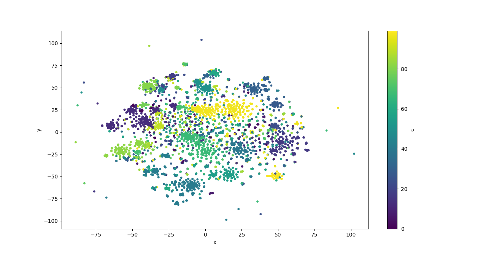
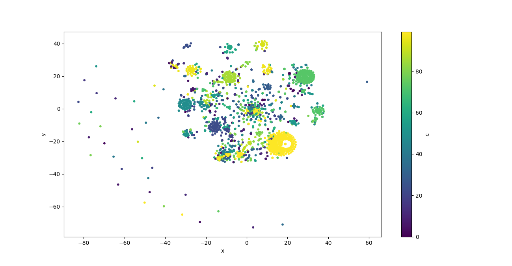
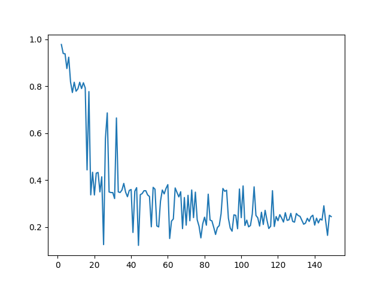
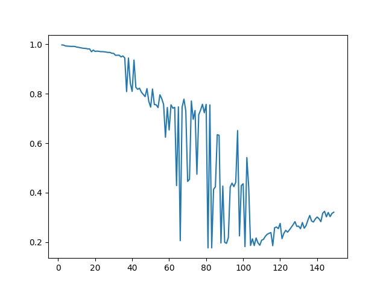
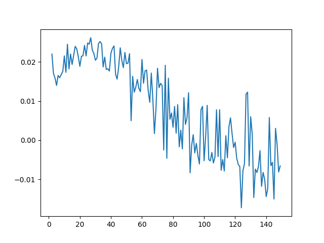
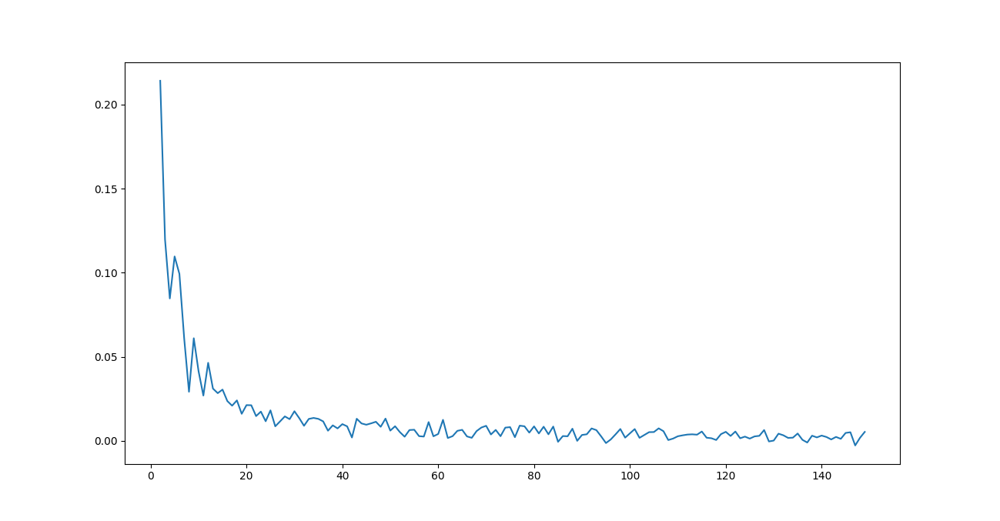

# Clustering de Palabras
##### Lautaro Martinez
---
El presente proyecto busca agrupar palabras como clases de equivalencia a través de clustering como herramienta explorativa.
Dicho proyecto forma parte del total evaluativo de la materia optativa "Minería de Datos para texto" FaMAF - UNC, ciclo 2021.

Para conocer mas información del proyecto, dirigirse [aquí](https://sites.google.com/unc.edu.ar/textmining2021/pr%C3%A1ctico/clustering).

---
El corpus utilizado se trata de notas periodisitcas de [La Vanguardia](https://www.lavanguardia.com/). Se puede encontrar este corpus, y similares [aquí](https://cs.famaf.unc.edu.ar/~laura/corpus/) (directorio de corpus de [_Laura Alonso Alemany_](https://cs.famaf.unc.edu.ar/~laura/)).

---

### Introducción

Se realizaron 3 procesamientos diferentes (iteraciones) del corpus alplicando el algoritmo [K-means](https://en.wikipedia.org/wiki/K-means_clustering) para clustering por su eficiencia computacional en uso general.
Si bien el corpus completo cuenta con mas de 30 millones de palabras, debido a los limitados recursos con los que se cuenta, se utilizaron las 200.000 primeras palabras.

#### Procesamiento 1
En esta primer iteracion se partió procesando el dataset mediante la librería [Spacy](https://spacy.io/) para tokenizar, separar en sentencias, obtener etiquetas de POS y de morfología, lo cual nos vendra de ayuda posteriormente para las ternas de dependencias.

Se removieron los signos de puntuación, símbolos y dígitos pues no aportan información adicional valiosa en este intento de agrupar palabras.

Para finalizar el preproceso del dataset, se creo un diccionario donde se encuentran todas las palabras que deseamos agrupar en distintos clusters, descartando aqullas que ocurren menos de 10 veces en todo el dataset para de esta forma no obtener vectores de palabras que aportan **poca** información en la co ocurrencia.

Seguido de esto, comienza la vectorización de las palabras.
Importante notar que trabajaremos sobre los lemmas de las palabras para unificarlas en el clustering final.
Las características (features) utlizadas en la vectorización son:
* Etiqueta POS (Part-of-spech)
* Etiqueta DEP (Dependency)
* Co occurencia con todas las demás palabras (lemmatizadas) del diccionario en una ventana de [2, 2] (i.e. las palabras a distancia 2 detras y 2 delante) con una frecuencia mayor a 10 en todo el dataset.
* Triplas de dependencia

Con los vectores de las palabras se construyó la matriz donde cada fila es una palabra y las columnas son todas las features nombradas previamente, obteniendo así dimensiones (5564, 25538).

Notar que en la matriz muchos valores son cero por la co ocurrencias entre palabras. Debido a esto, se descartaron aquellas filas con una varianza pequeña pues no aportan información relevante y para reducir las dimensiones, posteriormente,  se aplico [LSA](https://en.wikipedia.org/wiki/Latent_semantic_analysis) mediante la librería [Scikit-learn](https://scikit-learn.org/stable/) para obtener un número óptimo de 100 columnas [sugeridas por la misma](https://scikit-learn.org/stable/modules/generated/sklearn.decomposition.TruncatedSVD.html?highlight=truncatedsvd#:~:text=Desired%20dimensionality%20of%20output%20data.%20Must%20be%20strictly%20less%20than%20the%20number%20of%20features.%20The%20default%20value%20is%20useful%20for%20visualisation.%20For%20LSA%2C%20a%20value%20of%20100%20is%20recommended.).

Finalmente, se realizó el algoritmo de K-means de la librería [NLTK](https://www.nltk.org/) utilizando la distancia coseno y k=100 sobre la matriz LSA para obtener los clusters de palabras.

Además, se aplico [T-sne](https://en.wikipedia.org/wiki/T-distributed_stochastic_neighbor_embedding) de la librería scikit-learn sobre la matriz original para descomponerlo en dos dimensiones y poder graficar los clusters para analizarlos visualmente.

##### Resultados

Comenzamos viendo un cluster de las stopwords. Notar que estas no fueron descartadas en el preprocesado pues son de necesidad al momento de obtener las tarnas de dependencia.

> [atrás, no, sólo, también, económicamente, más, aun, así, ya, entonces, allí, respectivamente, mucho, parcialmente, casi, ahora, fácilmente, recién, solamente, demasiado, ahí, bien, exclusivamente, adelante, tímidamente, prácticamente, cautelarmente, expresamente, rápidamente, efectivamente, periódicamente, diariamente, decisivamente, excesivamente, quizá, claramente, paralelamente, legalmente, clandestinamente, apenas, internacionalmente, mas, judicialmente, formalmente, obviamente, sinceramente, principalmente, abajo, abiertamente, amablemente, disciplinadamente, precisamente, ostensiblemente, rabiosamente, debajo, estrictamente, activamente, correctamente, delante, gravemente, físicamente, significativamente, forzosamente, personalmente, habitualmente, aparentemente, totalmente, previamente, particularmente, debidamente, No, desinteresadamente, asimismo, informáticamente, tradicionalmente, visualmente, curiosamente, detrás, brevemente]

Aquí lo interesante es ver que "de", no se encuentra en el cluster de las stopwords, pero sino que se encuentra en su propio cluster

> [de, y, dels, PARA, ou, Entre, DEL, Sobre]

Además contamos con cluster de nombres bastante acertados:
> [Manuel, Barcelona, Carmen, Neus, Raquel, Bella, Noble, MARGARITA, Cotxeres, doquier, Medio, PDI, dúplex, Ayuntamiento, MONTORNÈS, BADALONA, Armand, Manfred, Sergei, ECHAUZ, Harley, Papá, Combinación, ona, tu, Nissan, Capgrossos, Confraria, Fadel, Integración, Tica, Juli, Elíes, Escéptico, Escolania, Tokio, Kii, Ir, Museu, Seguint, Grecia, Endesa, Marta, FRANCISCO, Muafaq, Normal, Milton, Pinochet, Lógica, Gabriel, Seat, Viñals, Conciutadans, Talleres, brigada, Setmana, Haussmann, Urgente, Cuartel, Speer, Himmler, HeinrichHimmler, Julia, Drew, in, ustedes, Ludoètnia, juegos, Anthony, Natalia, Televisión, millonarios, Ricardo, Rom, Mare, Toluges, Torricó, nouvelle, Instituto, bonnes, STAC, MADRID, Rafael, Remei, Gabinete, Marian, France, Mariví, Clara] 

Otro cluster curioso es "turismo", si bien contiene palabras nada relacionadas al tema esto puede deverse a la ventana utilizada y el dataset "pequeño".

> [administración, vuelo, geografía, español, Transportes, chárter, ruso, turista, pasajero, llegada, Rusia, Departamento, medias, actitud, volar, ciudadano, mentalidad, queja]

Para concluir con esta iteración, un cluster esperado y efictivamente logrado, el de verbos:
> [adelantar, asegurar, explicar, subrayar, expresar, criticar, averiar, retrasar, manifestar, subjetivo, ocurrir, gustarte, estético, redondeado, rascar, profesora, revelar, opinar, aprender, advertir, justificar, esconder, comer, aplaudido, asegurado, montar, suscitar, cosechar, Castellbisbal, promovido, obligar, Efe, identificar él, Van, recuento, Plaza, página, Lampedusa, aspiración, aficionar, insufrible, escenario, agreír, frail, diferencier, asistente, amar, excluir, tornar, despegar, contradecir, preceder, elevar, considerar él, plantar, palmera, tronco, guía, documentado, elogiar, presidir, sancionar, recordarles, fijar, caber, habilitar, acercar, esquivar, Virtudes, coronar, participar, constituir, repicar, fabricación, alquilar, aportar, intercambio, Optó, Joseba, intentar, significar, interrogar, banalizar, bromear, traer, relatar, caro, distinguir, perjudicar, solidarizar, quejar, ensanchar, FLOTATS, habitado, zumr, concentrar, empuje, traen, transcurrir, dispuesto, detectar, ir él, lamentar, morir, molina, ENVÍE, certificar, resaltar, anular, estatua, TERRASSA, volcar, publicar, sorprender, pass, protección, comprobado, procesar, impresionar, legendario, inhumano, embargar, increíble, quisiérar, desguazado, atreveír, nombrar, pervivir, anhelo, oir, estacionado, Aunque, fijar yo, hagan, disertacer, simpatizar, heredar, apasionar, resumir, evacuar, Isaac, reformar, atestado, tender, regia, entusiasta, importar, socavada, amenizar, propiciar, culminación, instruir, cercar, suicidar, desatar, camiseta, receptivo, extrañar él, promoción, desafíar, seleccionar, destrozar, amplíar, desaguar, agravar, ligar, incierto, proliferir, instalar él, recaudar, enrrollar, felicitar, Pincho, shopping, mestizo, empadronado, convocar, gato, pintar, corear, librar, combinar, SANT, bailaor, desvanecir, saturar, dudar, protagonizar, estribillo, promover, emplazar, okupación, Medievalia, Marrecs, capgrosso, Festes, tirallongues, infructuoso, contento, vinculado, despistado, vender él, proporcionar, editor, dureza, indignar, invitar, poca, abordar, apretar, sustanciar él, tendrir, retener, topar, Proliferaron, valorar, idóneo, llego, excesivo, tomadura]

#### Procesamiento 2

En esta segunda iteración se experimento cuando se utiliza una ventana [0, 1], es decir, cuando vemos la co ocurrencias de 0 palabras detras y una palabra delante.
De esta forma podemos caracterizar las palabras segun la palabra que le sigue a ella.

Se comenzó, al igual que en el procesamiento 1, con el procesamiento de Spacy para separar en tokens.
Se descartaron aquellas palabras que ocurren menos de 10 veces y se prosiguió con la vectorización de las mismas.

Para este caso solo se utilizaron como características (features):
* Co occurencia con todas las demas palabras (lemmatizadas) del diccionario en una ventana de [0, 1].

Si bien el uso de esta característica es malo, pues tendremos a lo sumo un unico 1 en todo el vector, es interesante experimentar para ver los resultados que se obtienen para no replicarlo en el futuro.

Con los vectores se armó una matriz de (3656, 359), descartando aquellos vectores que eran solo ceros pues la palabra que tenian por delante era un símbolo, dígito, o no pertenecia a las palabras con frecuencia mayor a 10 en todo el dataset.

Sobre las matriz se aplicó T-sne con dos dimensiones para poder diferenciar los clusters graficamente.

Se aplico LSA sobre la matriz original reduciendo las columnas aun más a solo 100, y se aplicó el algoritmo K-means con distancia coseno y k=100 para obtener los clusters.

##### Resultados

Cluster "de", previamente dicho cluster era el de stopwords en la primer iteración.

> [de, cuenta, dejar, cubrir, mejora, acabar, distrito, sur, refugio, libro, fuerza, desaparecer, vicepresidente, horas, dalmau, artístico]

Cluster de "y":
> [y, cerdà, cuadro, culpa, seguro, deporte, urbano, vallès, referéndum, bmw, caja, terrassa, magrebí, magòria, mccloskey, miramar, okupa, unidos]

En general los clusters obtenidos carecen de sentido claro pues es complejo comprender (o agrupar) palabras por la palabra siguiente unicamente. Quizá aumentando drasticamente el dataset utilizado con mayor cantidad de ejemplos se podrian obtener resultados mas coherentes.
Además, es claro notar la diferencia de población entre los clusters teniendo algunos cientos de palabras, mientras otros clusters cuentan con una unica palabra.

Parte del cluster de "cómo":
> [él, sólo, económico, actualmente, pronto, fregona, cómo, si, nunca, ahora, veces, luego, carlos, evidencia, finalmente, quien, perro, capítulo, urbanístico, falda, sexto, feijoo, hundimiento, socialista, rico, abuela, nadie, alegría, marca, derbi, ocasión, continuación, texto, paralelamente, ambulancia, cantabria, difícilmente, estable, archivo, traer, bulgari, rettangolo, infravivienda, inglés, disco, comité, bordeta, hallazgo, tranquilo, curioso, seguint, incapacitar, cuestionar, tampoco, dimitir, tan, himmler, roberts, barrymore, campbell, sicilia, dani, excepcionalmente, reservado, forestier, televisivo, comitiva, ...]

Si bien en esta sección realizamos menciones especiales, el listado completo de todos los clusters se encuentra dentro del directorio *Resultados/*.

#### Procesamiento 3

En esta última iteracion se optó por un camino alternativo. En vez de aplicar una heuristica propia de vectorización de las palabras. Realizarlo mediante librerias de Scikit-learn con [CountVectorizer](https://scikit-learn.org/stable/modules/generated/sklearn.feature_extraction.text.CountVectorizer.html) y [TF-IDFVectorizer](https://scikit-learn.org/stable/modules/generated/sklearn.feature_extraction.text.TfidfVectorizer.html?highlight=tfidf#sklearn.feature_extraction.text.TfidfVectorizer) para comparar los clusters obtenidos de estas vectorizaciones.

Al igual que las iteraciones anteriores, se partio por procesar el corpus con Spacy para tokenizar y separar en sentencias.

Luego, se construyó una lista de sentencias que cuenten con mas de 10 palabras, pues de lo contrario aportan poca información.

A esta lista se les aplicó ambos procedimientos de CountVecotrizer y TF-IDFVectorizer, obteniendo asi dos matrices (3789, 14618) donde las filas son las sentencias, y las columnas son las plabras.

Se aplico LSA para reducir las dimensiones a 100 a ambas matrices para luego correr el algoritmo K-means con k = 50 para obtener los clusters.

##### Resultados

Al igual que previas iteraciones, la salida completa del programa se encuentra dentro de la carpeta *Resultados/*.

Aqui un listado de las 10 palabras más relacionadas con los 10 primeros clusters mediante TF-IDF:
> Cluster 0
Frequent terms: barcelona, revisión, anterior, entre, una, los, misma, año, quedan, real

> Cluster 1
Frequent terms: barcelona, las, autopistas, los, anual, hoy, actuar, decreto, suyas, tras

> Cluster 2
Frequent terms: barcelona, suyas, aprobó, debía, real, de, congelados, iba, generalitat, ayer

> Cluster 3
Frequent terms: barcelona, marcha, ayer, suspender, que, las, anual, el, debía, autopistas

> Cluster 4
Frequent terms: barcelona, los, dar, autopistas, marcha, hoy, debía, quedan, sin, entrar

> Cluster 5
Frequent terms: barcelona, sus, atrás, ayer, el, mismo, dar, año, peajes, subida

> Cluster 6
Frequent terms: barcelona, consejo, iba, precios, conocer, del, correspondientes, aprobó, suspender, dar

> Cluster 7
Frequent terms: barcelona, subir, los, gobierno, correspondientes, titularidad, de, decidió, aprobó, en

> Cluster 8
Frequent terms: barcelona, nuevo, tienen, se, concesionarias, tras, manera, titularidad, incrementar, ayer

> Cluster 9
Frequent terms: barcelona, atrás, anual, dar, suspender, mismo, de, en, manera, hoy

> Cluster 10
Frequent terms: barcelona, decidió, quedan, en, generalitat, anual, hoy, vigor, consejo, suspender

Podemos destacar como "barcelona" se relaciona con casi todos los clusters, debido a que se trata de un termino muy repetido en el corpus del peridico español utilizado.

Vemos ahora los clusters obtenidos de CountVectorizer:

> Cluster 0
Frequent terms: barcelona, dar, suspender, marcha, en, generalitat, que, vigor, hoy, decidió

> Cluster 1
Frequent terms: barcelona, peajes, quedan, autopistas, ayer, subida, anual, entrar, que, conocer

> Cluster 2
Frequent terms: barcelona, de, las, peajes, la, debía, marcha, autopistas, gobierno, dar

> Cluster 3
Frequent terms: real, barcelona, un, dar, aprobó, correspondientes, ministros, tras, suyas, hasta

> Cluster 4
Frequent terms: barcelona, los, la, subir, sus, que, cuenta, ministros, suyas, no

> Cluster 5
Frequent terms: peajes, barcelona, congelados, autopistas, subida, dar, ayer, anual, generalitat, suspender

> Cluster 6
Frequent terms: barcelona, las, de, en, generalitat, quedan, atrás, dar, suspender, vigor

> Cluster 7
Frequent terms: barcelona, congelados, decidió, marcha, la, consejo, que, dar, en, revisión

> Cluster 8
Frequent terms: barcelona, ayer, las, decidió, subida, anual, debía, iba, equivalente, vigor

> Cluster 9
Frequent terms: barcelona, las, congelados, de, decidió, atrás, suspender, dar, quedan, la

> Cluster 10
Frequent terms: barcelona, la, generalitat, congelados, quedan, las, los, subida, vigor, dar

#### Obtener el k ídeal

Para las iteraciones 1, 2 y 3, se utilizó la [métrica de Silhoutte](https://en.wikipedia.org/wiki/Silhouette_(clustering)) mediante la librería de Scikit-learn para conocer el k ídeal que proponia, de esta forma obtuvimos los siguientes graficos:

##### Iteración 1 - Métrica Silhouette

##### Iteración 2 - Métrica Silhouette

##### Iteración 3 TF-IDF - Métrica Silhouette

##### Iteración 3 CountVectorizer - Métrica Silhouette

Frente a esto, no es claro el k óptimo mediante esta métrica vista en clase pues indicaría que más de 5000 palabras (en la iteración 1) se podrian agrupar en, idealmente, cerca de 10 o 15 clusters. Pero al realizarlo, los palabras dentro de un mismo cluster no tenian coherencia entre sí.

Es por ello que se grafico los vectores con T-sne y se hizo una aproximación a ojímetro y varios intentos con k distintos, quedandonos asi un k = 100 en las dos primeras iteraciones, y 50 en la última.

De cualquier forma, es interesante notar que la métrica, es inferior a 0.7, un valor "minimamente bueno" en la tercer iteracion utilizando CountVectorizer y TF-IDFVectorizer
