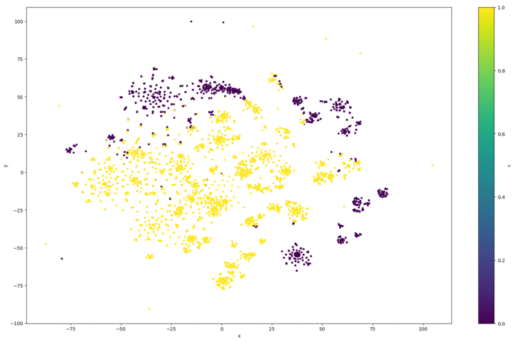
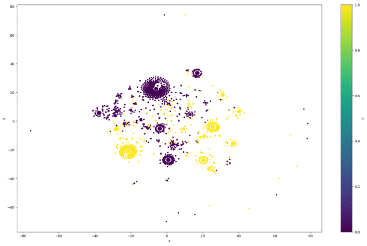

# Clustering de Palabras
##### Lautaro Martinez
---
El presente proyecto busca agrupar palabras como clases de equivalencia a través de clustering como herramienta explorativa.
Dicho proyecto forma parte del total evaluativo de la materia optativa "Minería de Datos para texto" FaMAF - UNC, ciclo 2021.

Para conocer mas información del proyecto, dirigirse [aquí](https://sites.google.com/unc.edu.ar/textmining2021/pr%C3%A1ctico/clustering).

---
El corpus utilizado se trata de notas periodisitcas de [La Vanguardia](https://www.lavanguardia.com/). Se puede encontrar este corpus, y similares [aquí](https://cs.famaf.unc.edu.ar/~laura/corpus/) (directorio de corpus de [_Laura Alonso Alemany_](https://cs.famaf.unc.edu.ar/~laura/)).

---

### Introducción

Se realizaron 3 procesamientos diferentes (iteraciones) del corpus alplicando el algoritmo [K-means](https://en.wikipedia.org/wiki/K-means_clustering) para clustering.
Se utilizó K-means por su eficiencia en uso general con gran volumenes de datos.
Si bien el corpus completo cuenta con mas de 30 millones de palabras, debido a los limitados recursos con los que se cuenta, se utilizaron las 200.000 primeras palabras en la primer iteracion, y 300.000 en las restantes.

### Clase WordClustering

Se creó la clase *WordClustering* para contener los datos y procedimientos que son de uso común a todas las iteraciones.
Importante notar que ciertos metodos de la clase deberan ser llamados únicamente luego de la llamada a metodos previos definidos en su documentación en el script.
Notar que *WordClustering* no es un clase robusta, no fue diseñada para un uso general; su único porposito es este proyecto.
En la primer iteración se proveeran las lineas de código que realizan cada actividad descripta para comprender el script, las demás son similares.

#### Procesamiento 1
Antes de comenzar con la iteración se parte creando el objeto *WordClustering* encargado de los datos de esta iteración, y cargamos en memoria el corpus para su procesamiento.
Al cargar a memoria realizamos una limpieza del codigo básica removiendo números, puntos y símbolos pues no aportan información valiosa.

```python
wc = WordClustering(path, size)         # Creación de objeto
wc.get_dataset(clean = True)            # Carga a memoria junto a limpieza básica
```
En esta primer iteración se partió procesando el dataset mediante la librería [Spacy](https://spacy.io/) para tokenizar, separar en sentencias, obtener etiquetas de POS, DES, ENT y de morfología, lo cual nos sera de utilidad posteriormente para las ternas de dependencias.

```python
wc.spacy_pipe_processing()
```

Para finalizar el preproceso del dataset, se crea una lista de tokens que quedremos agrupar y se descartaron aqullas palabras que ocurren menos de 10 veces en todo el dataset para de esta forma no obtener vectores de palabras que aportan **poca** información en la co ocurrencia.

```python
wc.get_tokens()                             # Obtener tokens
wc.get_token_frequency(min_frequency=10)    # Obtener frecuencia de palabras descartando aquellos con menos de 10 ocurrencias
```

Seguido de esto, comienza la vectorización de las palabras.
Importante notar que trabajaremos sobre los lemmas de las palabras para unificarlas en el clustering final, esto es pues considero que contamos con pocos ejemplos.
Las características (features) utlizadas en la vectorización son:
* Etiqueta POS (Part-of-spech)
* Etiqueta DEP (Dependency)
* Etiqueta ENT (Entity), si es que se trata de una entidad nombrada.
* Co occurencia con todas las demás palabras (lemmatizadas) del diccionario en una ventana de [2, 2] (i.e. las palabras a distancia 2 detras y 2 delante) con una frecuencia mayor a 20 en todo el dataset.
* Triplas de dependencia

```python
wc.vector_generator(min_frequency=10)       # Generar vectores de palabras 
```

> En esta iteración usamos mucha información que nos caracteriza las palabras, ayudados por el procesamiento de la librería spacy, a la hora de la generación de caracteristicas, esto nos ayudará que los clusters de palabras tengan buena "coherencia" entre sí.

Con los vectores de las palabras se construyó la matriz donde cada fila es una palabra y las columnas son todas las features nombradas previamente, obteniendo así dimensiones (5347, 22896).
Notar que en la matriz muchos valores son cero por la co ocurrencias entre palabras. Debido a esto, se descartaron aquellas filas con una varianza pequeña pues no aportan información relevante.

```python
wc.generate_feature_matrix(process = True, min_variance = 0.0002)  # Generar matriz de caracteristicas
```

Para reducir las dimensiones, posteriormente,  se aplicó [LSA](https://en.wikipedia.org/wiki/Latent_semantic_analysis) mediante la librería [Scikit-learn](https://scikit-learn.org/stable/) para obtener un número óptimo de 100 columnas [sugeridas por la misma](https://scikit-learn.org/stable/modules/generated/sklearn.decomposition.TruncatedSVD.html?highlight=truncatedsvd#:~:text=Desired%20dimensionality%20of%20output%20data.%20Must%20be%20strictly%20less%20than%20the%20number%20of%20features.%20The%20default%20value%20is%20useful%20for%20visualisation.%20For%20LSA%2C%20a%20value%20of%20100%20is%20recommended.).

```python
wc.apply_LSA()
```
Finalmente, se realizó el algoritmo de K-means de la librería [NLTK](https://www.nltk.org/) utilizando la distancia coseno y k=20 sobre la matriz LSA para obtener los clusters de palabras.

```python
wc.apply_Kmeans_clustering(matrix_to_cluster = "LSA", 20)
```

Además, se aplicó [T-sne](https://en.wikipedia.org/wiki/T-distributed_stochastic_neighbor_embedding) de la librería scikit-learn sobre la matriz original para descomponerlo en dos dimensiones y poder graficar los clusters para analizarlos visualmente.

```python
wc.apply_TSNE()
```


##### Resultados

Comenzamos viendo un cluster de las stopwords. Notar que estas no fueron descartadas en el preprocesado pues son de necesidad al momento de obtener las ternas de dependencia.

> [el, de, y, su, en, a, por, del, al, como, este, para, con, todo, ese, tanto, según, desde, si, nuestro, mediante, mi, sobre, Ni, Si, dels, per, Y, Desde, Según, Mientras, ou, Entre, bastante, históricamente, DEL, d, Mediante, u, Con, Bajo, Sobre]

Además contamos con cluster de nombres bastante acertados:
> [Piqué, Grau, Manuel, Nadal, Cerdà, Bori, Fontestà, Carmen, Posadas, Arturo, Shakespeare, Dickens, Mireia, Carlos, Bárbara, Margot, Raquel, Bella, Otero, MARGARITA, PUIG, EDUARD, PAGANI, ROIG, I, Mitre, Bosco, Vergòs, Doctor, Roux, Carme, Karr, José, Ignacio, Cuervo, Transportes, Celestino, Corbacho, Richard, Rogers, Alonso, Balaguer, Arquitectes, Associats, Pompidou, Tony, Blair, Rodríguez, SABADELL, Feijoo, Guifré, Jaume, García, Van, Anton, Pombo, Armand, Querol, Eduard, Pallejà, Luis, Vilallonga, Phillida, década, Dolores, Cárcer, Ros, madre, Alfonso, XIII, Juan, Begoña, Aranguren, Adriano, Yourcenar, Manfred, Grebe, Vázquez, Montalbán, Fabrizio, Antonia, Joshe, Satrústegi, Mercedes, Salisachs, Fusi, Juncadella, Maribel, López, Lamadrid, Magda, Robert, Àlex, Soler, Roig, Federico, Correra, Cirera, Nieves, Ormaolea, Haneke, Alorda, Eduardo, Fondevila, Paquita, Reixach, Sergei, Seskutov, Xavier, Sàez, Giné, Pilar, Arnalot, Francesc, Pané, Antoni, Siurana, Aprilia, Harley, Davidson, Negre, Albert, Gimeno, Miguel, Antoñanzas, quién, Sebastià, Serrano, Parkinson, Guttmann, Àngels, Bayés, Recursos, Sanitaris, Eugeni, Sedano, Consol, Busto, Ramírez, Salomó, Nin, margarita, puig, Joaquín, Ortín, PATIÑO, Pau, Sampons, Maria, Civis, Benjamín, Martí, Virtudes, Miquel, Ángel, Borges, Blanques, Font, Cervera, Codina, Jordi, Magrí, Ivars, Noguera, Laura, Porta, Rubió, Campanes, Núria, Gispert, Àngel, Sol, Món, Fadel, Ilyas, Joseba, Achotegui, Pla, Estratègic, Frederic, Ballell, Tica, Pensament, Justícia, Marín, Virginia]

Otro cluster curioso es el de adjetivos, si bien contiene palabras nada relacionadas al tema esto puede deverse a la ventana utilizada y el dataset "pequeño".

> [obligado, subjetivo, estético, redondeado, difícil, suficiente, preñado, menor, aplaudido, asegurado, junto, importante, municipal, promovido, situado, previsto, pequeño, malo, insufrible, duro, independiente, abandonado, dirigido, documentado, urbanizado, pesimista, caro, habitado, dispuesto, herido, conocido, comprobado, legendario, inhumano, increíble, desguazado, detonación, estacionado, atestado, entusiasta, socavada, notable, gratuito, receptivo, repartido, incierto, mestizo, empadronado, tirallongues, infructuoso, contento, vinculado, despistado, encarcelado, poca, idóneo, excesivo]

Para concluir con esta iteración, un cluster esperado y efictivamente logrado, el de verbos:
> [quedar, entrar, tener, incrementar, adelantar, ser, despertar, interpretar, señalar, explicar, permitir, beneficiar, subrayar, compensar, prever, definir, expresar, indicar, reclamar, caer, llegar, empezar, convertir, cebar, penetrar, provocar, hacer, emplear, resguardar él, filtrar, evitar, criticar, avisar, ver él, acabar, conducir él, ver, aprovechar, llenar, averiar, afectar, retrasar, necesitar, manifestar, responder, gustarte, cambiacer, usar él, rascar, mirar, diseñar, utilizar, sonoro, alejar, residir, querer, saber, relato, revelar, posesivo, generar, conquistar, soledad, vencer, opinar, nacer, formar, transformar, durar, aprender, centrar, calificar, advertir, justificar, negar, poner yo, resolver él, aceptar, valer, seguir, esconder, comer, hacer él, merecer, marchar, tardar, sufrir, circular, dirigir, montar, recubrir, suscitar, registrar, cosechar, hallar, precisar, ditribuir, reforzar, continúar, avanzar, disponer, Castellbisbal, invertir, resolver, identificar, inaugurar, destacar, planear, obligar, iniciar él, sostener, diagnosticar, ...]

Como se mencionó, obtuvimos buenos clusters de palabras pues utilizamos features que aportaban mucha información sobre ellas, no como en la siguiente iteración.

#### Procesamiento 2

En esta segunda iteración se experimento utilizando una ventana [0, 1], es decir, cuando vemos la co ocurrencias de 0 palabras detras y una palabra delante.
De esta forma podemos caracterizar las palabras segun la palabra que le sigue a ella.

Se comenzó, al igual que en el procesamiento 1, con el procesamiento de Spacy para separar en tokens.
Se descartaron aquellas palabras que ocurren menos de 10 veces y se prosiguió con la vectorización de las mismas.

Para este caso solo se utilizaron como características (features):
* Co occurencia con todas las demas palabras (lemmatizadas) del diccionario en una ventana de [0, 1] con ocurrencia minima de 30.

Si bien el uso de esta única característica es malo, pues tendremos a lo sumo un único 1 en todo el vector, es interesante experimentar para ver los resultados que se obtienen para no replicarlo en el futuro, y ver que pasa.

Con los vectores se armó una matriz de (4099, 139), descartando aquellos vectores que eran solo ceros pues la palabra que tenian por delante era un símbolo, dígito, o no pertenecia a las palabras con frecuencia mayor a 30 en todo el dataset.

Sobre las matriz se aplicó T-sne con dos dimensiones para poder diferenciar los clusters gráficamente.


Se aplicó LSA sobre la matriz original reduciendo las columnas aun más a solo 100, y se aplicó el algoritmo K-means con distancia coseno y k=40 para obtener los clusters.

##### Resultados

Cluster "de", previamente dicho cluster era el de stopwords en la primer iteración.

> [de, otro, calle, máximo, caso, venta, acabar, sur, disponer, voluntad, Ayuntamiento, refugio, par, allá, norma, Barceloneta, alcance, vicepresidente, surgir, arrancar, marzo, citado, horas, encargar, Dalmau, u, intentar él, erigir]

Cluster de verbos, mucho mas contaminado que la iteracion anterior:
> suspender, subir, congelar, hasta, entre, incrementar, paralizar, imitar, explicar, permitir, compensar, apruebe, causar, ni, En, cuando, cubrir, saltar, según, desde, descender, aprovechar, parcialmente, porque, si, faltar, mejorar, rascar, estudiar, notar, mediante, generar, vencer, crecer, sobre, públicamente, solamente, echar él, dificultar, preocupante, superar, arbitrar, sacar, valer, Ni, bien, I, tocar, recubrir, alcanzar, cosechar, bajar, modificar, motivar, De, implantar, prácticamente, recoger, negociar, resolver, construir él, durante, levantar, miércoles, respetar, finalizar, cortar, contra, regular, castigar, apoyar, originar, descartar, conceder, ampliar, romper, observar, robar, cepillir, enseñar, confirmar él, sembrar, atribuir, cita, preceder, alumbrar, era, seguramente, oficialmente, certamen, reivindicar, salvar, padecer, presidir, cumplir, verter, facilitar, caber, ...]


En general los clusters obtenidos carecen de sentido claro pues es complejo comprender (o agrupar) palabras por la palabra siguiente únicamente. Quizá aumentando drasticamente el dataset utilizado con mayor cantidad de ejemplos se podrían obtener resultados más coherentes.

Si bien en esta sección realizamos menciones especiales, el listado completo de todos los clusters se encuentra dentro del directorio *Resultados/*.

#### Procesamiento 3

En esta última iteración se optó por un camino alternativo. En vez de aplicar una heurística propia de vectorización de las palabras. Realizarlo mediante la librería de [Gensim](https://radimrehurek.com/gensim/), [Word2Vec](https://radimrehurek.com/gensim/models/word2vec.html).

Notar que Word2Vec [utiliza redes neuronales](https://en.wikipedia.org/wiki/Word2vec#:~:text=The%20word2vec%20algorithm%20uses%20a,a%20large%20corpus%20of%20text.&text=The%20vectors%20are%20chosen%20carefully,words%20represented%20by%20those%20vectors.) para representar palabras mediante vectores

Al igual que las iteraciones anteriores, se partió por procesar el corpus con Spacy para tokenizar y separar en sentencias.

Luego, se construyó una lista de sentencias que cuenten con mas de 10 palabras, pues de lo contrario aportan poca información.

A esta lista se les aplicó el algoritmo de Word2Vec, obteniendo asi una matriz de dimensiones (8938, 100) .

Finalmente se corrio el algoritmo K-means con k = 50 para obtener los clusters.

Al igual que en iteraciones posteriores, se redujo la dimensiones a solo 2 mediante T-SNE para graficarlo y analizarlo.


##### Resultados

Al igual que previas iteraciones, la salida completa del programa se encuentra dentro de la carpeta *Resultados/*.

Aquí un listado de las 10 palabras más relacionadas con los 10 primeros clusters:
> Cluster 0
y, a, Barcelona, o, años, ciudad, año, Ayuntamiento, plaza, Sant, calle

> Cluster 1
entrada, campo, ministro, paella, entorno, muerte, enormes, Collserola, ve, perder

> Cluster 2
puerto, zonas, renovación, base, márgenes, vecinales, barracas, palabras, llevan, sociedad

> Cluster 3
pleno, coches, motivo, sentido, superior, posibilidad, móvil, cosa, XIII, proceso, Wagner

> Cluster 4
llegar, vehículo, evitar, principios, celebra, sede, camino, hombres, norte, Anna

> Cluster 5
paseo, recuperar, ayuda, producto, interior, segundos, viene, domingo, PUIG, Sants

> Cluster 6
nombre, manifestantes, compañías, mantiene, cree, enfermedad, capital, arte, urbanos, ideas

> Cluster 7
altura, transporte, hombre, presentación, marzo, sentencia, Tarragona, viajar, metropolitana, visión

> Cluster 8
mayores, edificios, vienen, museo, Jaume, casas, Marta, polígono, Sol, vehículos

> Cluster 9
Europa, seguridad, Maragall, servicios, alumnos, espacio, Ripoll, prácticos, nueve, ciclo

Lo vemos en los clusters y en el gráfico de ellos, es difícil poder definir como se estan agrupando las palabras pues no conocemos las features que esta utilizando la red neuronal de Word2Vec.
De cualquier forma, es un algoritmo rápido y eficiente para un proyecto general. Pero es claro como algoritmos con heurisitcas propias permiten definir reglas acordes a proyectos con objetivos específicos.

---

#### Obtener el *k* ídeal

Para las iteraciones, se utilizó la [métrica de Silhoutte](https://en.wikipedia.org/wiki/Silhouette_(clustering)) mediante la librería de Scikit-learn para conocer el k ídeal que proponia, de esta forma obtuvimos los siguientes graficos:

##### Iteración 1 - Métrica Silhouette

<p align="middle">
    
    
</p>

##### Iteración 2 - Métrica Silhouette

<p align="middle">
    
    
</p>

##### Iteración 3 Word2Vec - Métrica Silhouette

<p align="middle">
    
    
</p>

Frente a esto, no es claro el k óptimo mediante esta métrica vista en clase pues indicaría que más de 5000 palabras (en la iteración 1) se podrian agrupar en, idealmente, cerca de 1 o 5 clusters. Pero al realizarlo, los palabras dentro de un mismo cluster no tenian buena coherencia entre sí.

Es por ello que se graficó los vectores con T-SNE y se hizo una aproximación a "ojímetro" y varios intentos con k distintos, quedandonos asi un k = 20 en la primer iteración, k = 40 en la segunda, y k = 50 en la última.

De cualquier forma, es interesante notar que la métrica, es inferior a 0.7, un valor "minimamente bueno" en la tercer iteracion utilizando Word2Vec.

---

### Conclusiones

Se emplearon 3 tecnicas distintas de vectorización de palabras para su agrupamiento posterior. Este distintas vectorizaciones vienen dadas por las caracteristicas seleccionadas para dicho proposito.

Vimos como con caracteristicas que aportan mucha información como en la primer iteración con la terna de dependencias y diversas etiquetas, los cluster de palabras fueron coherentes a lo esperado.

Cuando se cuenta con poca información como en la segunda iteración, los clusters resultantes fueron dificiles de descifrar. Se requeriria de un gran dataset para nivelar esta falta de información.

Se podria incluso proponer un procesamiento intermedio entre las dos primeras iteraciones para evaluar los clusters resultantes.

Finalmente terminamos con una vectorización de palabras a travez de redes neurinales. El resultado no fue alentador. Si bien podemos confiar que las caracteristicas utilizadas tienen un soporte matematico, desconocerlas no nos permite comprender de forma satisfactoria como se han agrupado las palabras en los clusters. Lo positivo fue como este embedding neuronal nos permitió vectorizar las palabras en tan solo 100 caracteristicas totales.

De cualquier forma, fue interesante  utilizar el clustering como herramienta para, en este caso, comprender mejor las palabras bajo distintas caracteristicas que no necesariamente es la forma mas "human-friendly" como es el significado
